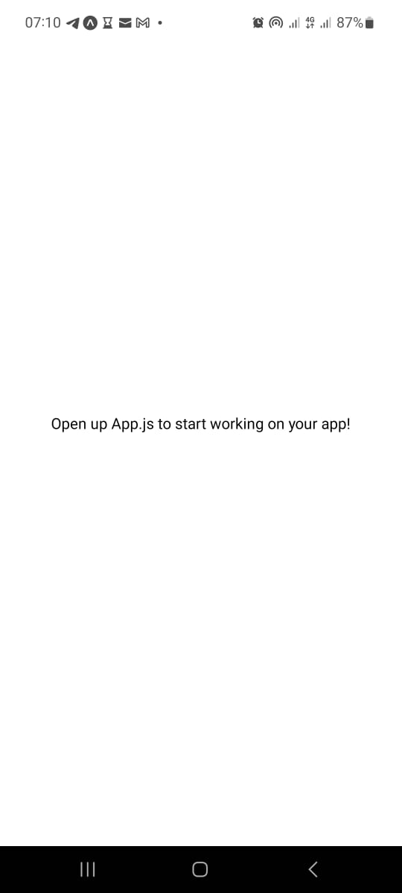

# Create Application

  1. Run `npx create-expo-app AwesomeProject`
  2. cd AwesomeProject
  3. Run `npx expo start`
  4. Scan the QR code using your mbile device and the the app will be up and running
  
  
  